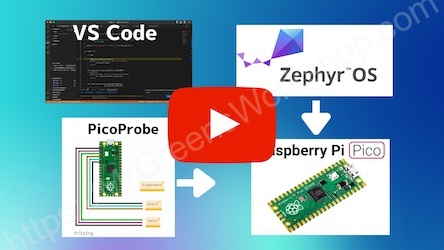

### How to create Zephyr RTOS based applications and start debugging with Raspberry Pi Pico in VS Code

---

Everything is covered in [this YouTube video](https://youtu.be/t-t-boemUZE).

- For further reading please check this [Blog post](https://www.mrgreensworkshop.com/posts/2022-06-10-raspberry-pi-pico-zephyr-os-part-2).

### You Can Support My Work

Creating projects like this takes a great amount of time. Much appreciated if you consider supporting me so that I can continue projects like this and creating new contents for everyone.

- You can support me on [GitHub Sponsors](https://github.com/sponsors/MrGreensWorkshop "Support me on GitHub Sponsors") (monthly or one time)
- You can be one of my patrons on [Patreon](https://patreon.com/MrGreensWorkshop "Be my Patron") (monthly)
- You can tip me via [Ko-fi](https://ko-fi.com/MrGreensWorkshop "Tip Me via Ko-fi") (one time)

### License

As it says in the [Apache License 2.0](https://github.com/MrGreensWorkshop/ZephyrOS_ButtonRasPiPicoVScodeDebug/blob/main/LICENSE.txt), you can use my code anywhere as long as you include the license file and copyright notice. Also, state if you make any changes.

`Copyright (c) 2022 Mr. Green's Workshop https://www.MrGreensWorkshop.com`

Please add link to my page so I can get credit for my work.

Thank you!